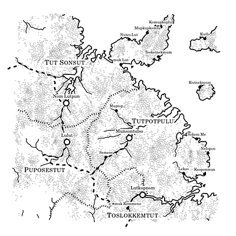

# Fantasy map generator

This is code for generating fantasy maps, using the algorithm behind [@unchartedatlas][uncharted]. For more details, see [these notes][notes].

[uncharted]: https://twitter.com/unchartedatlas
[notes]: http://mewo2.com/notes/terrain/

# Getting Started

## Default Example

The default example contains all the assest from the original [blog post](http://mewo2.com/notes/terrain/).

## React Examples 

This folder will contain any example using the React library.

### Terrain Create React App

This example leverages the [create react app starter](https://facebook.github.io/react/blog/2016/07/22/create-apps-with-no-configuration.html) which was created by the Facebook team. It also is an attempt to port the default js files to es6.  

[demo](http://www.headwinds.net/lab/terrain/)

